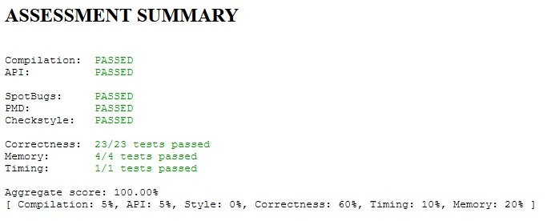

Baseball Elimination
====================

Given the standings in a sports division at some point during the
season, determine which teams have been mathematically eliminated from
winning their division.

[Specification](https://coursera.cs.princeton.edu/algs4/assignments/baseball/specification.php)

### Tests

