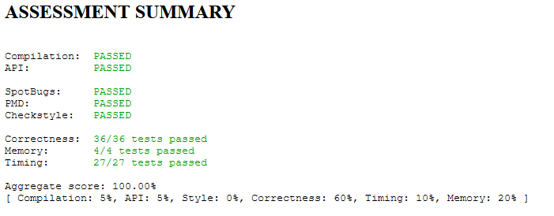

WordNet
=======

WordNet is a semantic lexicon for the English language that
computational linguists and cognitive scientists use extensively.

[Specification](https://coursera.cs.princeton.edu/algs4/assignments/wordnet/specification.php)

### Tests

